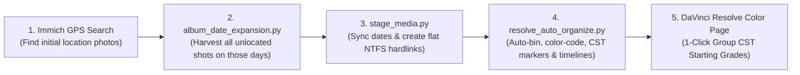

# Immich API Utilities & Media Workflow Suite

A collection of Python automation scripts and CLI utilities interacting with the [Immich REST API](https://immich.app/docs/api/) for album management, timelapse detection, stacking, bulk maintenance, cross-platform flat media staging, and **DaVinci Resolve Studio** auto-organization and color grading prep.

---

## 📂 Scripts & Documentation

| Script | Documentation | Description |
| :--- | :--- | :--- |
| [`resolve_auto_organize.py`](resolve_auto_organize.py) | [**`resolve_auto_organize.md`**](resolve_auto_organize.md) | Probes staged video metadata via container EXIF tags, groups clips into Bins by `Camera_Resolution`, assigns Clip Colors, and auto-creates Timelines in DaVinci Resolve. |
| [`stage_media.py`](stage_media.py) | [**`stage_media.md`**](stage_media.md) | Syncs event dates from an Immich album to stage master RAWs & videos as flat **NTFS hardlinks** for DaVinci Resolve, DxO PhotoLab, and NLEs. |
| [`album_date_expansion.py`](album_date_expansion.py) | [**`album_date_expansion.md`**](album_date_expansion.md) | Expands or updates an album with all photos matching existing asset dates (e.g. newly exported RAW edits, unlocated photos) with interactive album picker. |
| [`timelapse_stacking.py`](timelapse_stacking.py) | [**`timelapse_stacking.md`**](timelapse_stacking.md) | Interactive terminal wizard to detect timelapse sequences, visually verify them in browser via temporary albums, and group them into Immich Stacks. |
| [`create_album_from_log.py`](create_album_from_log.py) | [**`create_album_from_log.md`**](create_album_from_log.md) | Populates or updates an Immich album from a `timelapse_stacking_last_run.json` log in Index Mode (covers only) or Collection Mode (all frames). |
| [`timelapse_unstack.py`](timelapse_unstack.py) | [**`timelapse_unstack.md`**](timelapse_unstack.md) | Lists and deletes Immich stacks by frame threshold (`MIN_FRAMES`) with dry-run support and interactive confirmation. |

---

## 🏔️ End-to-End Archival & Editing Pipeline



---

## 📋 Prerequisites & Installation

- Python 3.8+
- Dependencies: `requests`, `python-dotenv` (Note: `stage_media.py` and `resolve_auto_organize.py` also work with standard library & `ffprobe`)

Install requirements:

```bash
pip install -r requirements.txt
```

---

## ⚙️ Environment Configuration

Copy the template [.env.example](.env.example) to `.env`:

```bash
cp .env.example .env
```

Configure your server URL and API key in `.env`:

```dotenv
IMMICH_BASE_URL=http://localhost:2283
IMMICH_API_KEY=your_api_key_here
IMMICH_ALBUM_ID=86e11802-83db-44d3-bdb6-dcf0e4c0d6ca # Default album UUID

# Optional Media Staging Overrides
# MEDIA_BASE_DIR=/mnt/wd14tb/_MY PHOTOS and VIDEOS
# MEDIA_STAGING_DIR=/mnt/wd14tb/_RESOLVE_IMPORT_STAGING

# Timelapse Stacking Defaults
TIMELAPSE_DETECTION_SOURCE=duplicates
TIMELAPSE_MIN_FRAMES=10
TIMELAPSE_MAX_GAP_SECONDS=60
TIMELAPSE_MIN_REQD_SPAN_SECONDS=5
TIMELAPSE_MAX_CV_GAP=0.35
TIMELAPSE_MAX_CV_SIZE=0.10
TIMELAPSE_FILTER_LOCATION=false
```

---

## 🚀 Quick Start

### 1. Auto-Organize DaVinci Resolve Project & Color Prep
Inspect staged metadata:
```bash
python3 resolve_auto_organize.py --scan-only
```
With DaVinci Resolve Studio open, run:
```bash
python3 resolve_auto_organize.py
```

### 2. Stage Media for DaVinci Resolve / DxO PhotoLab
Stage all master RAWs and videos from your Immich album in 0.5s:
```bash
python3 stage_media.py --immich-album "Stampf" --clean --open
```

### 3. Expand Album by Date
Add missing photos from the same days to an album:
```bash
python3 album_date_expansion.py
```

### 4. Timelapse Stacking Wizard
Run the interactive wizard:
```bash
python3 timelapse_stacking.py
```

### 5. Generate Album from Stacking Log
Build an index or collection album from a previous run:
```bash
python3 create_album_from_log.py
```

### 6. Remove / Prune Stacks
Inspect and delete large stacks:
```bash
python3 timelapse_unstack.py
```

---

## 🛡️ Safety & Non-Destructive Design

- **Dry-run & Scan-only flags**: Supported across scripts (`-n` / `--dry-run` / `--scan-only`) to verify operations before executing changes.
- **Zero Duplication**: `stage_media.py` uses native NTFS hardlinks (0 GB extra storage) and checks `st_nlink > 1` on cleanup.
- **Media Preservation**: Stacking, unstacking, and album updates only alter metadata relationships in Immich; underlying photo assets are never deleted.
- **Rollback Log**: `timelapse_stacking.py` generates `timelapse_stacking_last_run.json` to enable automated one-click rollback.
