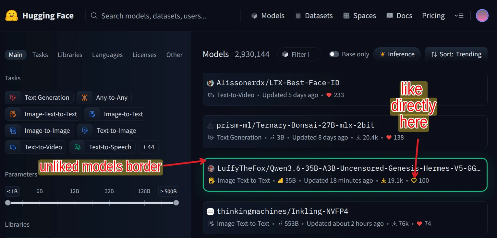

# Hugging Face Yellow Hearts & Unliked Model Highlighter

A feature-rich userscript for Hugging Face (`https://huggingface.co/models`) that highlights unliked models with a glowing green border and yellow outline heart (similar to Toppreise best price highlighter), shows native red hearts for liked models, and enables direct inline model liking from list cards.

## Features

- **Unliked Model Highlighter**: Adds a distinct emerald green border (`#10b981`) with soft glow around unliked models in search and listing cards.
- **Yellow Outline Unliked Hearts**: Unliked model heart icons stand out with a customizable golden yellow outline (`#fbbf24`).
- **Native Red Liked Hearts**: Liked models display with HF native red filled hearts (`#ef4444`) and clean borders.
- **Direct Inline Liking**: Click the heart icon on any model card in the list to instantly like/unlike the model inline without opening its page.
- **Micro-animations**: Magnifies unliked heart icons on hover with drop-shadow glow effects.
- **Configurable Floating FAB**: Interactive settings modal (FAB at bottom-right) allows customizing colors, scales, and toggling borders on/off.
- **Single Page Application Resiliency**: Uses debounced MutationObservers and CSS rules to handle dynamic page transitions and infinite scroll seamlessly.

## Installation

**One-click install** — open the raw script URL in your browser while Violentmonkey is active:

> [`huggingface-heart.user.js` (raw)](https://raw.githubusercontent.com/tazztone/scripts/main/userscripts/huggingface/huggingface-heart.user.js)

Violentmonkey will detect the `.user.js` file and show an install dialog automatically. Click **Confirm Installation**.

Manual install (copy-paste)

1. Open the Violentmonkey dashboard
2. Click **New Script**
3. Paste the contents of [`huggingface-heart.user.js`](huggingface-heart.user.js)
4. Save (`Ctrl+S`)

## Configuration

You can customize scaling, colors, and behaviors using the floating gear icon in the bottom right corner, or by editing the `CONFIG` object at the top of the script:

| Key | Default Value | Description |
| :--- | :--- | :--- |
| `ENABLED` | `true` | Turn overall heart styling on or off. |
| `COLOR_IDLE` | `'#fbbf24'` | Color of unliked heart SVG outline when idle. |
| `COLOR_HOVER` | `'#f59e0b'` | Color of unliked heart SVG outline when hovered. |
| `SCALE_IDLE` | `1` | Scale multiplier of unliked heart SVG when idle. |
| `SCALE_HOVER` | `1.2` | Scale multiplier of unliked heart SVG when hovered. |
| `BORDER_UNLIKED_ENABLED` | `true` | Enable green border highlighting around unliked models. |
| `BORDER_UNLIKED_COLOR` | `'#10b981'` | Border color for unliked model cards. |
| `BORDER_UNLIKED_GLOW` | `true` | Enable soft box-shadow glow around unliked model cards. |
