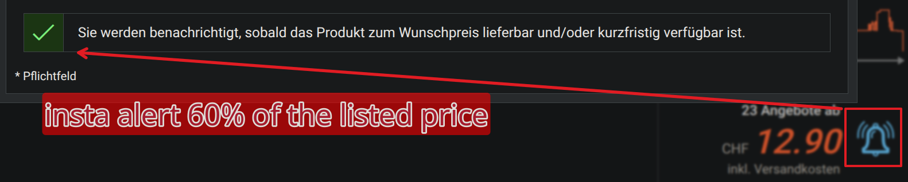

# Toppreise Price Alarm Automator

Userscript that fully automates the configuration of a price alarm on Toppreise.ch.

## 🚀 Installation

### 👉 [**CLICK HERE TO INSTALL USERSCRIPT**](https://github.com/tazztone/scripts/raw/refs/heads/main/userscripts/topp-alarm/topp-alarm.user.js)
*(Requires Violentmonkey / Tampermonkey)*

## Logic
When you click the "Preisalarm hinzufügen" (Bell icon) button on either a product page or an overview/search list page:
1. The script instantly intercepts the dynamic modal mounting.
2. It extracts the present reference price (shipping incl.) from the header.
3. Calculates the target alert at **60%** of the value.
4. Sets duration automatically to **2 years**.
5. Ensures the GDPR/Privacy Policy checkbox is selected.
6. Automatically submits the form to finalize the alert.

## Configuration
Edit the `CONFIG` block at the top of the file to customize settings:

| Key | Default | Description |
| :--- | :--- | :--- |
| `TARGET_PERCENT` | `0.60` | Ratio of the present value to set target alarm (e.g. `0.6` is 60%). |
| `DURATION_DAYS` | `"730"` | Internal code for alert duration expiry (730 = 2 years). |
| `AUTO_SUBMIT` | `true` | Instantly commits the submission. Set `false` for filling only. |
| `ACTION_DELAY_MS`| `300` | Safety buffer to wait for site UI scripting to stabilize. |

## Requirements
- You must be logged in to your Toppreise.ch user account beforehand so the system attaches the alert to your profile instantly.
